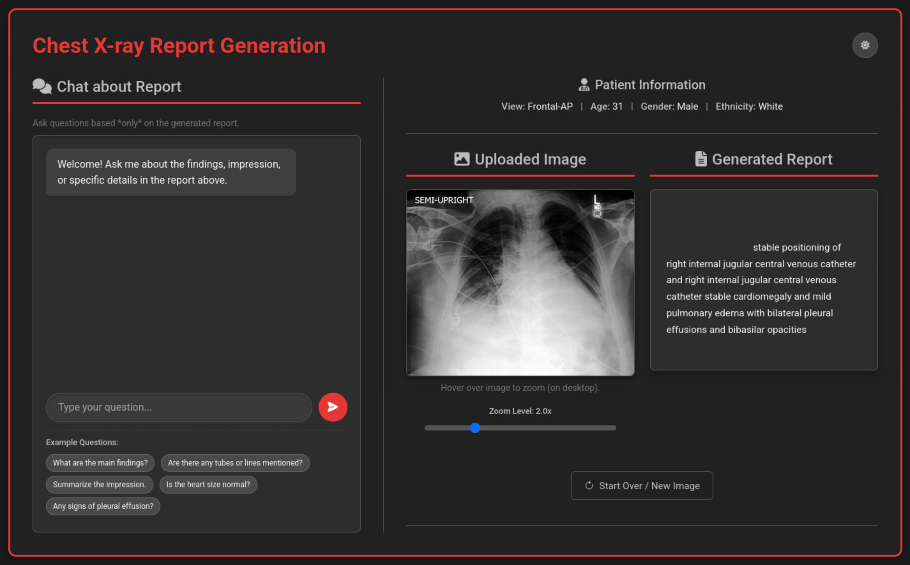
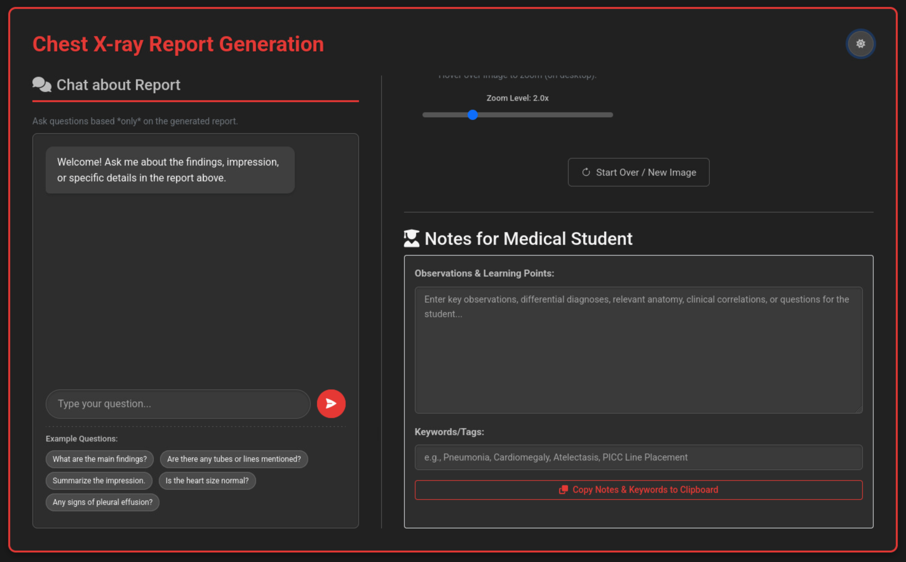
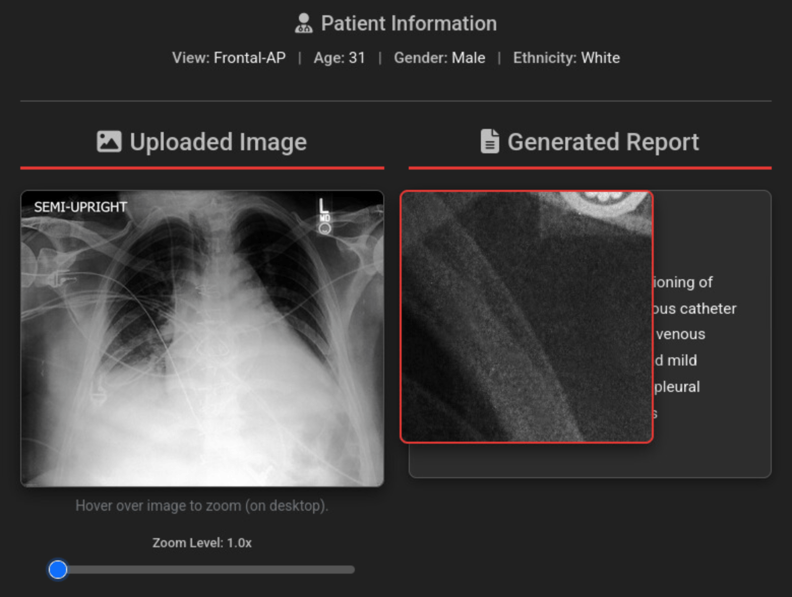
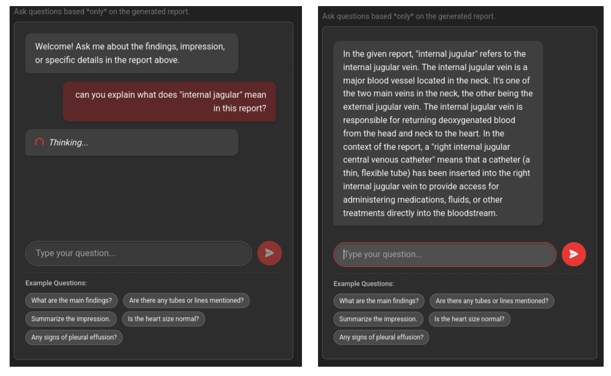
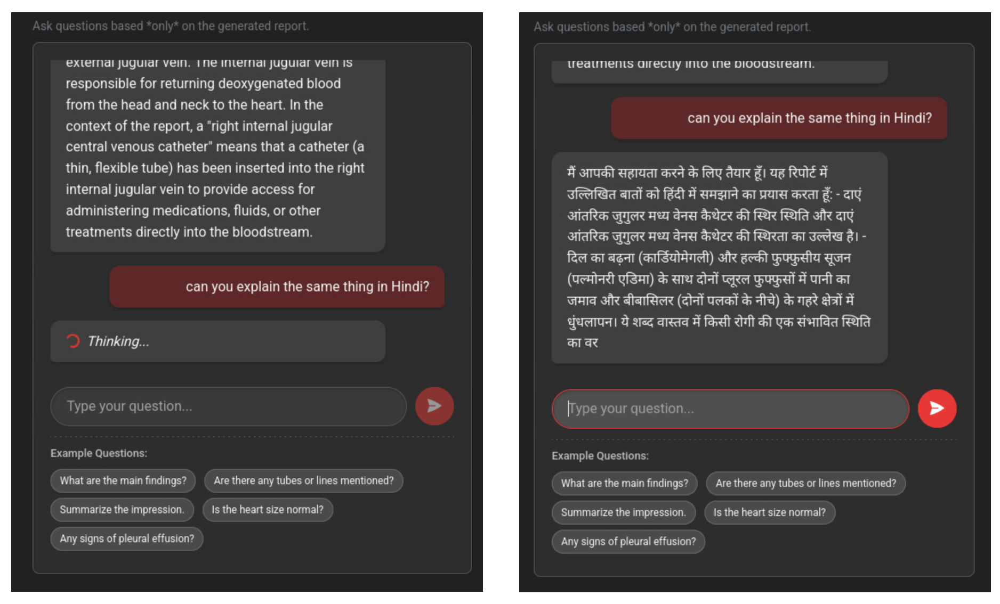
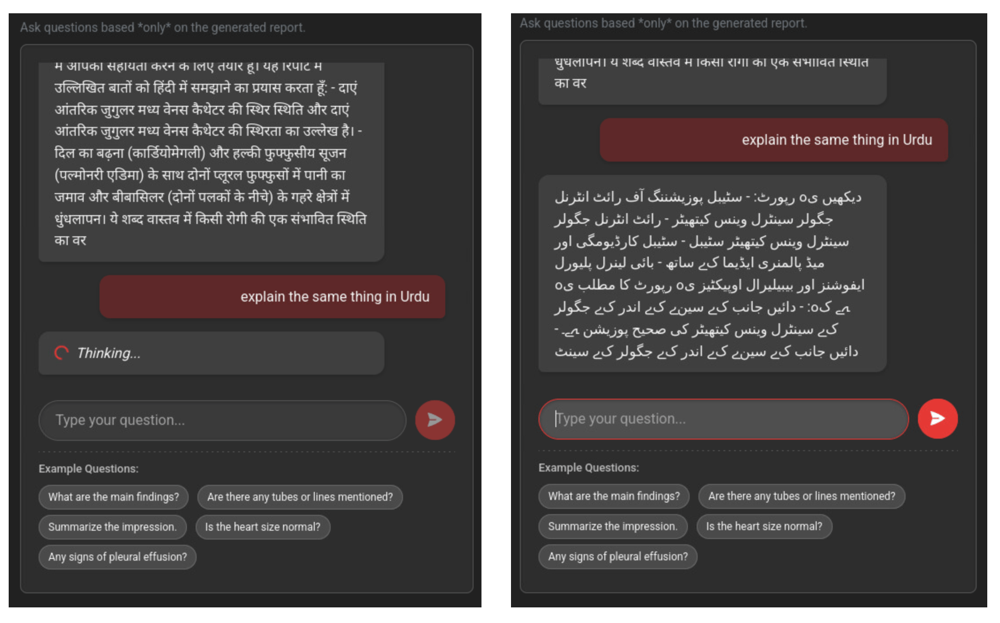
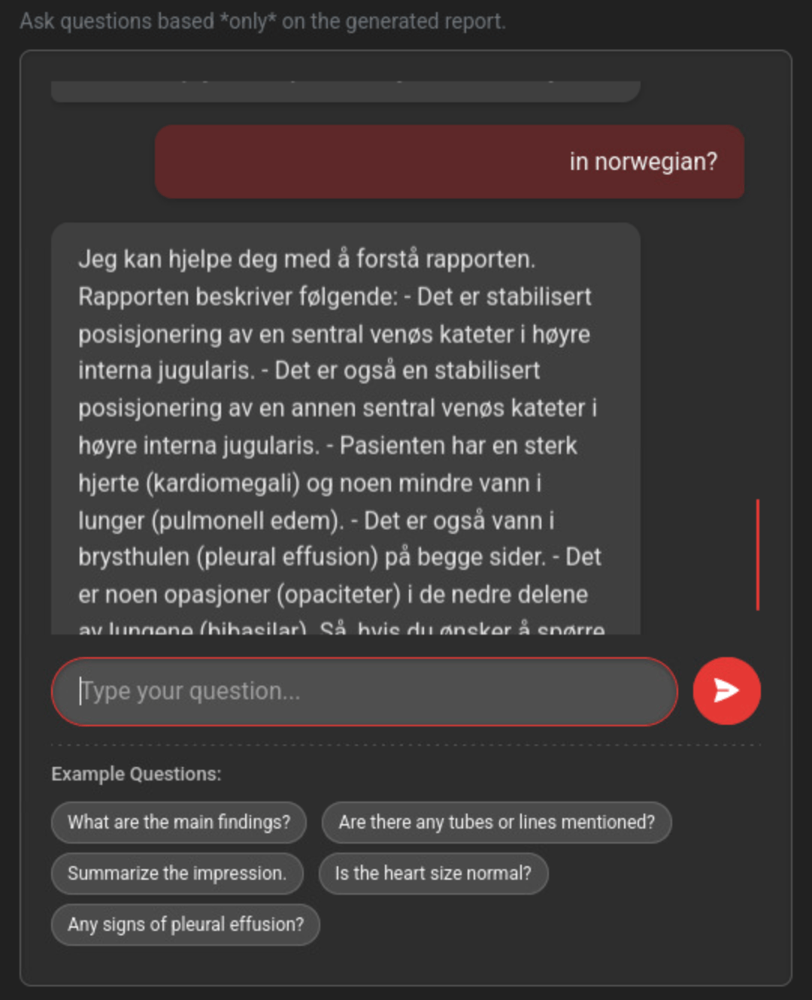

# 🩺 Chest X-ray Report Generation via Vision-Language Models

A modular monolithic web application that generates radiology-style reports from chest X-ray images using Vision-Language Models (VLMs) and supports multilingual, contextual question-answering via Large Language Models (LLMs).






---

## Overview

This project combines computer vision and natural language understanding to assist medical students and practitioners in interpreting chest X-rays. Users can:

- Upload chest X-ray images.
- Automatically generate medical-style reports using Swin-T5.
- Ask contextual questions about the report.
- Receive multilingual explanations (e.g., Hindi, Urdu, Norwegian).
- Take structured notes as a student or educator.

---

## Features

- 🔍 **Vision-Language Report Generation** (Swin-T5, Swin-BART, BLIP)
- 💬 **Interactive Chatbot (LLaMA-3.1)** with multilingual responses
- 🖼️ **Zoomable image preview**
- 📝 **Note-taking section for medical education**
- 🌗 **Dark/Light mode toggle**
- 🧪 **ROUGE-1 metric evaluation**
- 🔐 **No external API dependencies (except Hugging Face for model access)**

---

## Technology Stack

| Layer         | Technology                         |
|--------------|-------------------------------------|
| Backend       | Python, Flask, PyTorch, Hugging Face Transformers |
| Frontend      | HTML5, CSS3, JavaScript, Bootstrap |
| Deep Learning | Swin-T5, LLaMA-3, BLIP, Torchvision |
| Deployment    | Docker, NVIDIA CUDA, Git, GitHub   |
| Development   | VS Code                            |

See [`docs/architecture.md`](docs/architecture.md) for full breakdown.

---

## Application Architecture

This is a **modular monolithic** application organized into the following components:

- `app.py`: Main Flask entry point
- `vlm_utils.py`: Vision-Language Model loading and inference
- `chat_utils.py`: LLM-based contextual question answering
- `preprocess.py`: Image transformations and metadata extraction
- `templates/`: Jinja2 HTML files (frontend)
- `static/`: CSS, JS, and assets

---

## Getting Started

### Prerequisites

- Python 3.9+
- CUDA-enabled GPU (recommended)
- Docker (optional for containerized setup)

### Setup Instructions

```bash
# 1. Clone the repository
git clone https://github.com/ammarlodhi255/Chest-xray-report-generation-app-using-VLM-and-LLM.git
cd Chest-xray-report-generation-app-using-VLM-and-LLM

# 2. Create virtual environment
python -m venv venv
source venv/bin/activate  # or venv\Scripts\activate on Windows

# 3. Install dependencies
pip install -r requirements.txt

# 4. (Optional) Load HF Token for private LLaMA access
export HF_TOKEN=your_token_here

# 5. Running the App
python app.py

Then visit: http://127.0.0.1:5000
```
### LLM Interactions






